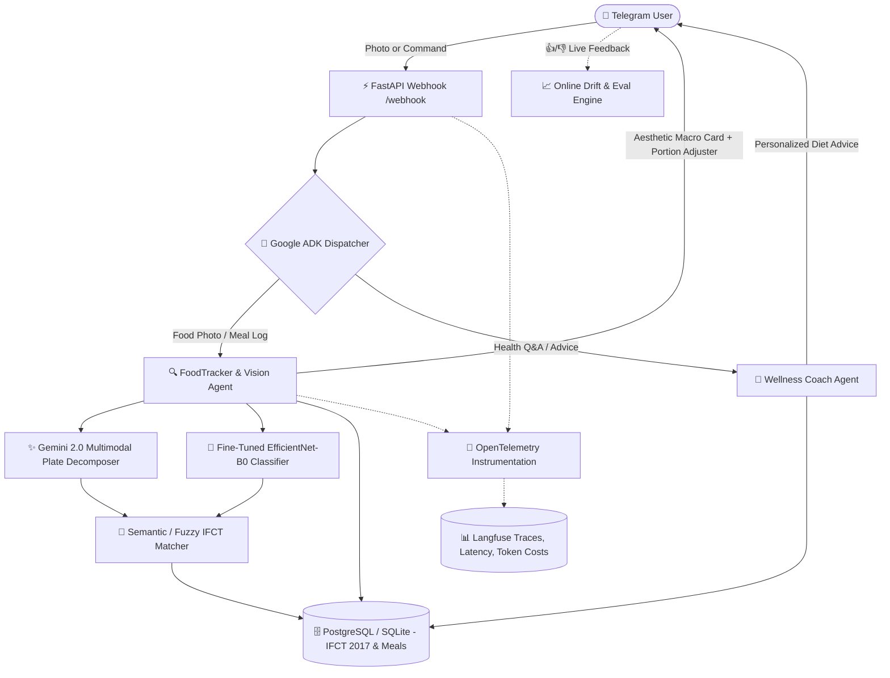

# 🥗 NutritionTrackerAI — AI-Powered Indian Food Nutrition Tracker

> A production-grade Telegram bot  specifically engineered for **Indian Cuisines & Thalis**. Combines a fine-tuned **Computer Vision model (EfficientNet-B0)**, a **Google ADK Dual-Agent architecture**, and **ICMR-NIN IFCT 2017 biochemical database grounding** with full **OpenTelemetry/Langfuse observability** and a **3-tier evaluation harness**.

---

## 🏛️ System Architecture



---

## 🚀 Key Engineering Innovations (AI Engineer Interview Highlights)

### 1. The "Indian Thali" Hybrid Vision Pipeline
* **The Challenge:** Real Indian meals are multi-dish compositions (e.g., *2 Rotis + Dal Tadka + Paneer Sabzi + Rice*). Traditional single-label image classification models fail on multi-item plates.
* **Our Solution:** A **Hybrid Pipeline**:
  1. **Gemini 2.0 Flash (Multimodal)** parses the scene and decomposes the plate into discrete items and portion estimates.
  2. **Custom Fine-tuned EfficientNet-B0** performs domain verification on regional Indian food classes.

### 2. Solving the IFCT Vocabulary Mismatch
* **The Challenge:** Users and vision models use colloquial names (*"Dal Fry"*, *"Paneer Makhani"*, *"Phulka"*), whereas the ICMR-NIN Indian Food Composition Tables (IFCT) use formal biochemical names (*"Pulse, Red gram, split"*, *"Wheat flour, whole"*). Exact SQL queries fail $>80\%$ of the time.
* **Our Solution:** A **Semantic & Fuzzy Matching Engine** (`db/semantic_matcher.py`) with alias containment and Levenshtein token similarity that maps colloquial dishes to grounded IFCT profiles and proportionally scales all 10 macros and micronutrients ($W/100\text{g}$).

### 3. Human-in-the-Loop Portion Disambiguation
* **The Challenge:** 2D images have intrinsic depth and density ambiguity (you cannot optically weigh grams or measure hidden ghee).
* **Our Solution:** Interactive Telegram **Inline Keyboard Adjusters** (`[Small -25%]`, `[Large +50%]`) that empower the user to adjust serving sizes with instant recalculation.

### 4. Streamlined Dual-Agent Google ADK Orchestration
* **The Challenge:** Multi-agent architectures with too many hops introduce 10–15s latency on Telegram webhooks.
* **Our Solution:** A focused **Dual-Agent Core** (Tracker Agent + Coach Agent) utilizing native tool routing to minimize roundtrips while enforcing clean separation of concerns.

### 5. 3-Tier Quantitative Evaluation Harness
* **Tier 1 (Offline CV):** Top-1 Accuracy, Top-3 Accuracy, and **Macro-F1** (addressing food class imbalance).
* **Tier 3 (Online Feedback & Drift):** Live $\text{👍}/\text{👎}$ feedback capture in database with automated drift alert triggers.

---

## 📂 Repository Structure

```
NutritionTrackerAI/
├── app/                         # FastAPI Web Application & REST API
│   ├── main.py                  # FastAPI lifespan, routes, & dashboard server
│   ├── routes.py                # REST endpoints (/api/analyze-food, /api/chat, /api/daily-summary)
│   ├── schemas.py               # Pydantic request & response validation
│   └── static/                  # Glassmorphic Web Dashboard UI
│       └── index.html           # Real-time photo upload, macro cards, portion adjust, chat
│
├── vision/                      # Computer Vision Model Pipeline
│   ├── config.py                # Hyperparameters & paths
│   ├── dataset.py               # TF Data loading, heavy augmentation
│   ├── model.py                 # EfficientNet-B0 transfer learning architecture
│   ├── train.py                 # Two-stage training (frozen -> fine-tuning)
│   ├── evaluate.py              # Top-1, Top-3, Macro-F1 evaluation
│   └── predict.py               # Single image inference engine
│
├── agent/                       # Google ADK Multi-Agent System
│   ├── root_dispatcher.py       # High-level request router
│   ├── tracker_agent.py         # Multimodal plate decomposition + IFCT grounding
│   ├── coach_agent.py           # Indian diet advice & health Q&A
│   └── tools/                   # Specialized agent tools
│       ├── classify_food_tool.py
│       ├── lookup_nutrition_tool.py
│       ├── meal_logger_tool.py
│       └── daily_summary_tool.py
│
├── db/                          # Database & Biochemical Grounding Layer
│   ├── models.py                # SQLAlchemy models (Users, Meals, IFCT profiles)
│   ├── connection.py            # Async engine with SQLite local fallback
│   ├── seed_ifct.py             # ICMR-NIN IFCT 2017 recipe seeder
│   └── semantic_matcher.py      # Fuzzy & semantic dish resolution
│
├── observability/               # Telemetry & Monitoring
│   └── setup.py                 # OpenTelemetry OTLP export to Langfuse
│
├── evals/                       # 3-Tier Evaluation Suite
│   ├── cv_eval.py               # Offline CV benchmark
│   ├── agent_eval.py            # Offline Golden dataset Calorie/Protein MAPE
│   ├── llm_judge.py             # G-Eval LLM-as-a-judge scoring
│   ├── online_eval.py           # Live feedback drift monitoring
│   └── golden_tests/
│       └── test_cases.json      # 25+ Ground-truth test meals
│
├── tests/                       # Pytest unit & integration test suite
│   ├── test_app_api.py
│   ├── test_vision.py
│   ├── test_db_and_matching.py
│   └── test_agent_and_tools.py
│
├── Dockerfile                   # Cloud Run compatible containerfile
├── docker-compose.yml           # App + PostgreSQL stack
└── requirements.txt             # Python dependencies
```

---

## ⚡ Quickstart Guide

### 1. Install Dependencies
```bash
pip install -r requirements.txt
```

### 2. Configure Environment Variables
Copy `.env.example` to `.env` and fill in your keys:
```bash
cp .env.example .env
```
* `GEMINI_API_KEY`: From [Google AI Studio](https://aistudio.google.com/) (Free tier).
* `DATABASE_URL`: (Optional) PostgreSQL URL or defaults to zero-config local SQLite.
* `LANGFUSE_PUBLIC_KEY` / `LANGFUSE_SECRET_KEY`: (Optional) for distributed tracing.

### 3. Run FastAPI Backend with Uvicorn
```bash
# Start backend server & dashboard
python -m app.main
# Or directly with uvicorn:
uvicorn app.main:app --host 0.0.0.0 --port 8000 --reload
```
Open **`http://localhost:8000`** in your browser to access the interactive web dashboard!

### 4. Run Evaluation & Test Suite
```bash
# Run Pytest Suite
python -m pytest tests/ -v

# Run Offline Agent Benchmark (Calorie & Protein MAPE)
python -m evals.agent_eval
```

---

## 🎙️ AI Engineer Interview Defense Guide

### Q1: "Why not use a single Multimodal LLM for everything?"
> **Answer:** *"While Multimodal LLMs are exceptional at general scene decomposition, they suffer from hallucinated nutritional densities and lack grounding in regional biochemical data. Furthermore, relying entirely on cloud LLMs for every interaction increases latency and token costs. Our hybrid architecture uses Gemini for scene decomposition, a custom fine-tuned EfficientNet-B0 for regional food verification, and grounds all nutritional numbers deterministically against the ICMR-NIN IFCT 2017 database."*

### Q2: "How do you handle the 2D depth and volume ambiguity problem?"
> **Answer:** *"Estimating volume from a single 2D image is an ill-posed inverse problem. We address this transparently: the agent makes a sensible baseline estimate using standard Indian portion weights (e.g., 1 katori dal $\approx$ 150g), but exposes interactive Telegram inline buttons (`[-25%]`, `[+50%]`) allowing the user to adjust the serving size in one tap. This keeps the UX fast while maintaining data integrity."*

### Q3: "How do you evaluate and monitor model drift in production?"
> **Answer:** *"We use a 3-tier evaluation framework. Offline, we measure Macro-F1 on the CV classifier and Calorie MAPE on agent golden test cases. Online, we instrument every request with OpenTelemetry exporting to Langfuse, and capture user satisfaction through inline 👍/👎 feedback buttons. If the dispute rate exceeds 25%, our drift monitoring service triggers an alert for retraining."*
